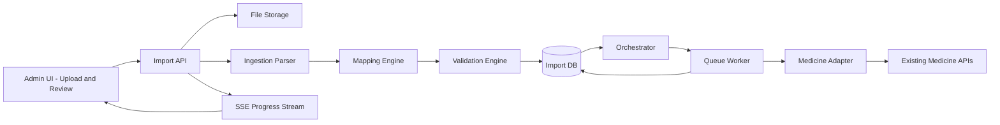
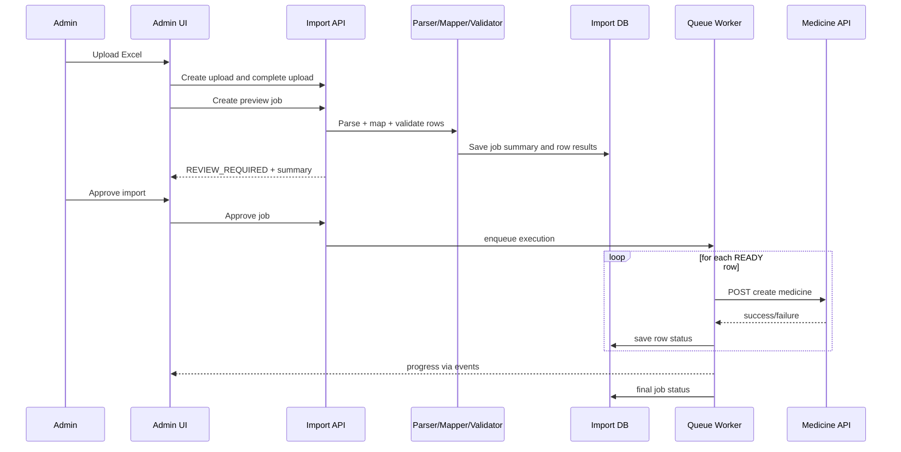
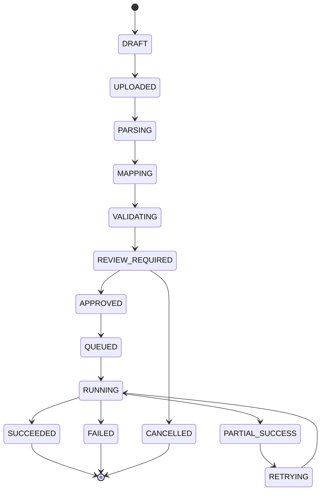
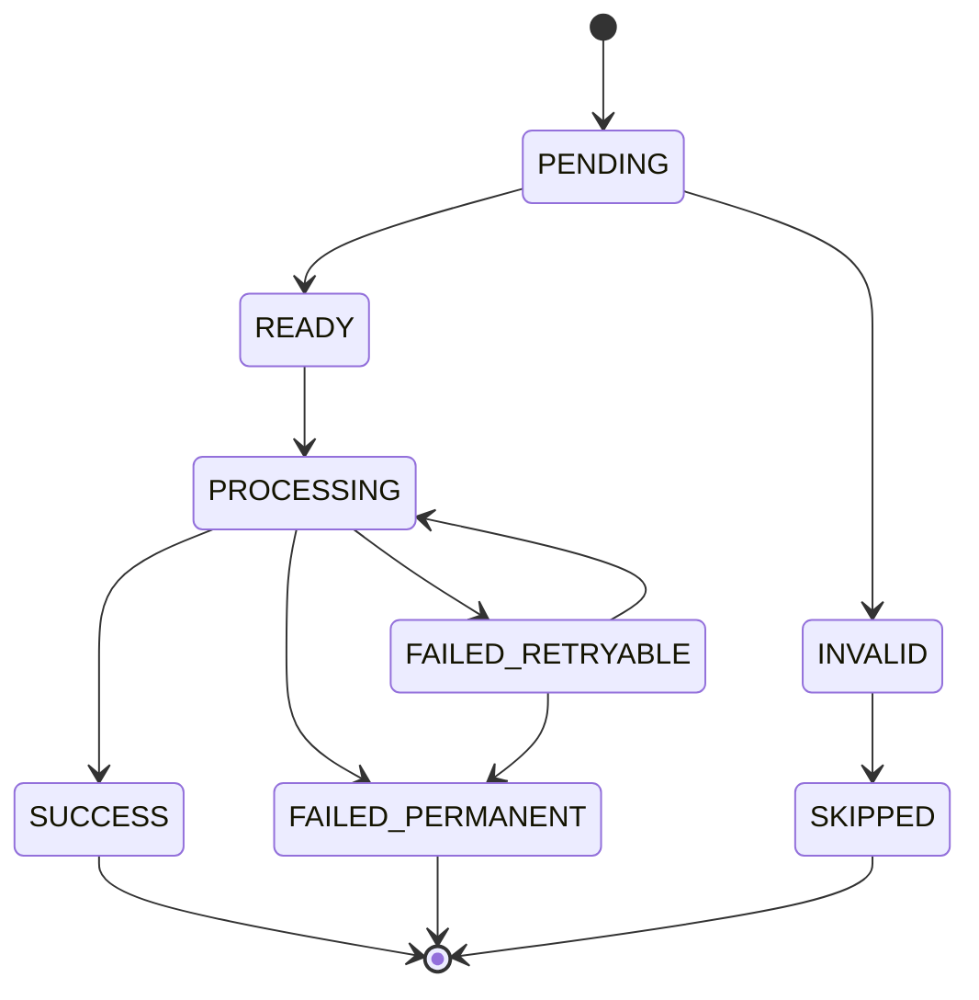

# GenAI Medicine Import - Architecture Overview

## 1) Document Control
- Version: 1.0
- Date: 2026-03-14
- Status: Draft for design review
- Audience: Product, Backend, Frontend, QA, DevOps

## 2) Objective
Enable admin users to upload an Excel file containing medicine records and complete high-volume medicine onboarding with:
- AI-assisted column mapping and normalization
- deterministic validation and human approval before write
- asynchronous row-wise import with retries and full audit trail

## 3) Design Principles
- AI assists, rules decide.
- No blind writes in early rollout.
- Every row action is traceable.
- Bad rows do not block valid rows.
- Idempotency prevents duplicate creates.

## 4) Scope
### In scope
- Admin file upload (Excel)
- Header mapping to canonical medicine schema
- Row validation with error/warning categorization
- Preview and manual approval
- Background import execution via queue worker
- Job and row-level status tracking
- Retry failed rows

### Out of scope (phase 1)
- Free-form conversational fixes directly changing validated rows
- Autonomous AI writes without approval
- Bulk update logic (upsert is phase 2/3 decision)

## 5) Canonical Import Schema
Required fields per row:
- medicineName
- medicineCode
- composition
- categoryCode

Optional fields (future-ready):
- manufacturer
- dosageForm
- strength
- mrp
- taxCode

## 6) High-Level Component Architecture

## 7) Component Responsibilities
### Admin UI
- Upload file
- Show mapping and validation summary
- Show invalid rows and reasons
- Approve/cancel/retry import
- Subscribe to progress events

### Import API
- Accept file metadata and upload completion
- Create preview job
- expose row-level previews
- process row overrides
- trigger job approval and execution

### Ingestion Parser
- Read worksheet and header row
- Normalize cell values
- Convert rows to structured payload

### Mapping Engine
- Rule-based synonym mapping first
- AI fallback for ambiguous headers
- Confidence scoring and rationale storage

### Validation Engine
- Required field checks
- Format rules (code patterns, text limits)
- Referential checks for category code
- Duplicate checks (input + persistent store)

### Orchestrator and Queue Worker
- Pick READY rows
- Call medicine create endpoint per row
- Retry transient failures
- Mark permanent failures
- Emit progress events

### Audit and Reporting
- Persist all state transitions
- Persist API request correlation ids and row outcomes
- Generate final report (success/failure counts and reasons)

## 8) Sequence (Happy Path)

## 9) Job and Row State Models
### Job state

### Row state

## 10) Data Model (Logical)
- ImportJob
  - jobId, createdBy, sourceFileKey, mode, state
  - totalRows, validRows, warningRows, invalidRows
  - approvedBy, approvedAt, startedAt, finishedAt
  - configJson, failureSummaryJson
- ImportRow
  - rowId, jobId, rowNumber
  - originalPayloadJson, mappedPayloadJson
  - validationStatus, executionStatus
  - errorCodesJson, errorMessage
  - retriesAttempted, medicineCode, medicineId, idempotencyKey
- MappingDecision
  - jobId, sourceHeader, targetField
  - mappingSource (RULE/AI), confidence, rationale
- AuditEvent
  - eventId, jobId, rowId, eventType
  - actorType, actorId, timestamp, payloadJson

## 11) API Surface (Phase 1)
Base path:
- /pp/webapp/api/admin/medicine-imports

Primary endpoints:
- POST /uploads
- POST /uploads/{uploadId}/complete
- POST /jobs (dryRun preview)
- GET /jobs/{jobId}
- GET /jobs/{jobId}/rows
- PATCH /jobs/{jobId}/rows/{rowNumber}
- POST /jobs/{jobId}/approve
- POST /jobs/{jobId}/cancel
- POST /jobs/{jobId}/retry-failed
- GET /jobs/{jobId}/events (SSE)

Detailed implementation sequencing is defined in docs/phase1-medicine-import-implementation-blueprint.md.

## 12) Security and Governance
- Role gate: ADMIN only
- File controls: size limit, extension + MIME whitelist, virus scan
- Data handling: encryption at rest and in transit
- Prompt safety: redact non-required fields before AI mapping
- Auditability: immutable event history for all user/system transitions

## 13) Reliability and Observability
- Queue backpressure and concurrency limits
- Retry policy with bounded attempts and exponential backoff
- Error budget based stop condition (for example stop if permanent failure rate exceeds threshold)
- Metrics: rows/sec, success ratio, retries, p95 endpoint latency
- Alerting: queue lag, worker failures, elevated API 5xx

## 14) Non-Functional Targets (Initial)
- Preview generated for 5k rows in under 2 minutes
- Import throughput at least 20 rows per second under normal API health
- Progress event freshness under 2 seconds
- Duplicate creation incidents: zero under idempotent replay

## 15) Open Architecture Decisions
- Create only vs upsert in phase 2
- Threshold for mandatory manual remap when AI confidence is low
- Hard block vs warning for selected data quality rules
- Batch size and concurrency default by environment
- Storage retention period for uploaded source files and audit payloads
