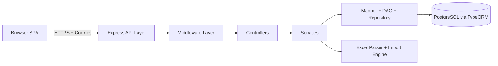
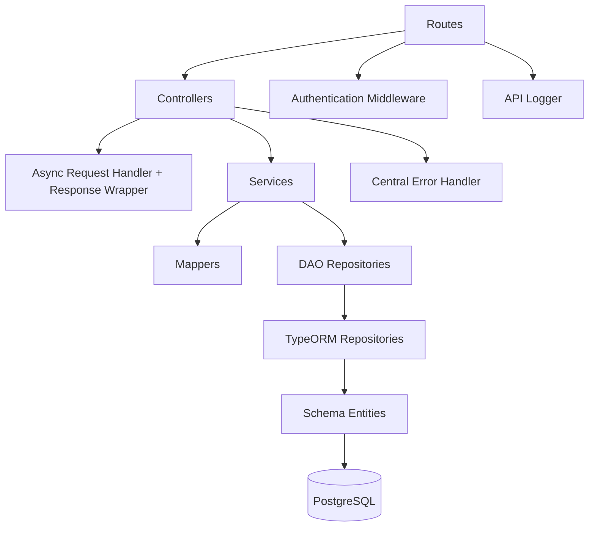

```
 _____  _                                _____  _           
 |  __ \| |                              |  __ \| |          
 | |__) | |__   __ _ _ __ _ __ ___   __ _| |__) | |_   _ ___ 
 |  ___/| '_ \ / _` | '__| '_ ` _ \ / _` |  ___/| | | | / __|
 | |    | | | | (_| | |  | | | | | | (_| | |    | | |_| \__ \
 |_|    |_| |_|\__,_|_|  |_| |_| |_|\__,_|_|    |_|\__,_|___/
                                                             
```

# PharmaPlus

PharmaPlus is a full-stack medicine commerce platform with role-based operations.
It includes a customer storefront (browse, cart, checkout, profile, order history) and an admin console (user visibility, medicine management, stock control, and Excel-based medicine import with preview and controlled execution).

## System Design Overview

### High-Level Architecture



### Backend Layered Architecture



### Frontend Architecture

```mermaid
flowchart TD
		APP[React App Shell + Router] --> PAGES[Feature Pages and Components]
		PAGES --> Q[React Query Hooks]
		Q --> API[Service Layer (Axios)]
		API --> BE[Backend API]

		PAGES --> STORE[Zustand Stores]
		STORE --> UI[Auth + Cart + Toast + Theme State]
```

## Tech Stack

### Backend
- Runtime: Node.js + TypeScript
- API Framework: Express
- ORM and Database: TypeORM + PostgreSQL
- Authentication: JWT (cookie-based session tokens)
- File Uploads: Multer (memory storage)
- Excel Processing: ExcelJS
- Logging: Winston + custom request/query loggers
- Utilities: body-parser, cookie-parser, cors, uuid, dotenv

### Frontend
- UI Framework: React 19 + TypeScript
- Build Tooling: Vite
- Routing: React Router
- Data Fetching and Caching: TanStack React Query
- Client State Management: Zustand
- HTTP Client: Axios
- Styling: Tailwind CSS + PostCSS + Autoprefixer

### Testing and Tooling
- Unit and Integration Testing: Jest + Supertest
- TypeScript Execution for backend dev: ts-node
- Concurrent local startup: concurrently

## Backend Design and Features

### Backend Responsibilities by Module

#### User and Auth Domain
- User registration and login
- Logout and current-session profile discovery
- Profile update
- Password change
- Forgot password and reset password flow using reset token checks
- Admin-only endpoint to list all users

#### Medicine and Stock Domain
- Read medicine catalog
- Admin create/update/delete medicine
- Read stock for one medicine
- Read stock for all medicines
- Admin update stock/price

#### Cart and Order Domain
- Modify cart quantities
- Fetch current user cart
- Place order from cart
- Fetch current user order history
- Payment processing hook and stock deduction during order
- Post-order cart clearing after successful checkout

#### Admin Medicine Import Domain (Phase 1)
- Create upload session with metadata validation
- Complete upload with Excel file transfer
- Sheet detection and header candidate detection
- Preview job creation with deterministic mapping and validation
- Row-level validation reporting and correction support
- Controlled approval to start execution
- Background-like async execution with retry and cancellation support
- Job summary and row listing with status filters

### Backend API Surface by Bounded Area

#### Users
- Base path: /pp/webapp/api/users
- Capabilities: create-user, login-user, logout, all-users, current-user, update-user, change-password, forgot-password, reset-password

#### Medicines
- Base path: /pp/webapp/api/medicines
- Capabilities: all-medicines, save-medicine, update-medicine, delete-medicine

#### Stocks
- Base path: /pp/webapp/api/stocks
- Capabilities: modify-stock, medicine-stock/:medicineCode, all-medicines-stock

#### Carts
- Base path: /pp/webapp/api/carts
- Capabilities: modify-cart, user-cart

#### Orders
- Base path: /pp/webapp/api/orders
- Capabilities: new-order, my-orders

#### Admin Medicine Imports
- Base path: /pp/webapp/api/admin/medicine-imports
- Capabilities: uploads, uploads/:uploadId/complete, jobs, jobs/:jobId, jobs/:jobId/rows, jobs/:jobId/rows/:rowNumber, jobs/:jobId/approve, jobs/:jobId/cancel, jobs/:jobId/retry-failed

### Backend Cross-Cutting Design
- Middleware chain: CORS, JSON parser, cookie parser, URL-encoded parser, API logger
- Role-aware access control for authenticated and admin-only operations
- Centralized async error handling and HTTP response shaping
- TypeORM schema-first entities for user, medicine, stock, cart, order, payment, and medicine import records

## Frontend Design and Features

### Route and Access Design
- Public routes:
	- /pharma-plus/home
	- /pharma-plus/medicines
	- /pharma-plus/medicines/:medicineCode
	- /pharma-plus/login
- Authenticated routes:
	- /pharma-plus/cart
	- /pharma-plus/profile
	- /pharma-plus/my-orders
- Admin-only routes:
	- /pharma-plus/admin
	- /pharma-plus/admin/users
	- /pharma-plus/admin/medicines/add
	- /pharma-plus/admin/medicines/update-stock
	- /pharma-plus/admin/medicines/import

### Frontend Feature Inventory

#### Authentication and Session
- Login and registration forms
- Session bootstrap from current-user query
- Route guards for authenticated and admin-only pages
- Logout via API

#### Catalog and Product Experience
- Medicine listing with pagination
- Category filtering
- Min/max price filtering
- Medicine detail page with stock and pricing

#### Cart and Checkout
- Local cart state in Zustand with server synchronization
- Add/remove medicine quantity
- Three-phase checkout flow:
	- Delivery address collection and validation
	- Summary confirmation
	- Payment details and order placement
- Payment fallback behavior when selected method fails

#### Orders and Profile
- My Orders page with latest and historical order data
- Profile view and in-place profile editing
- Profile page integrated with order history summary

#### Admin Operations
- Admin dashboard with quick actions
- List all users
- Add medicine
- Update medicine stock/price with medicine-code suggestions
- Medicine import workflow:
	- Upload workbook
	- Select sheet/header row
	- Generate preview summary
	- Inspect invalid rows
	- Start, cancel, and retry execution
	- Poll job progress summary

### Frontend State and Data Design
- React Query manages server cache, invalidation, and mutation lifecycles
- Zustand stores separate concerns:
	- Auth store
	- Cart store
	- Toast store
	- Theme store
- Service layer centralizes API calls and response normalization

## Feature Matrix (Frontend to Backend)

| Feature | Frontend Area | Backend Area |
|---|---|---|
| User auth and profile | Auth, Profile pages | User routes/controller/service |
| Medicine browsing | Medicines, Medicine Details pages | Medicine + Stock routes/services |
| Cart management | Cart and Medicine Details pages | Cart routes/service |
| Checkout and order placement | Cart checkout flow | Order + Payment + Stock services |
| Order history | My Orders, Profile | Order routes/service |
| Admin medicine catalog updates | Admin add/update pages | Medicine and Stock admin endpoints |
| Admin users management | Admin users page | Users admin endpoint |
| Admin medicine import | Admin import page | Medicine import routes/controller/service |

## Related Design Docs
- docs/genai-medicine-import-architecture-overview.md
- docs/phase1-medicine-import-implementation-blueprint.md

## Development Scripts

### Workspace Root
- npm run start: runs backend and frontend together
- npm run backend: runs backend server (nodemon)
- npm run client: runs frontend app from client workspace
- npm run test: executes backend jest tests

### Client Workspace
- npm run dev: starts Vite dev server
- npm run build: TypeScript build + Vite production build
- npm run preview: preview production build locally
